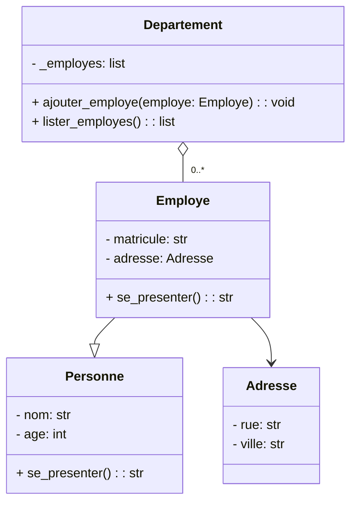

Solution du diagramme de classes pour un système de gestion d'un refuge pour animaux.

```mermaid
classDiagram
    class Personne {
        - nom: str
        - age: int
        + se_presenter(): str
    }
    class Adresse {
        - rue: str
        - ville: str
    }
    class Employe {
        - matricule: str
        - adresse: Adresse
        + se_presenter(): str
    }
    class Departement {
        - _employes: list
        + ajouter_employe(employe: Employe): void
        + lister_employes(): list
    }

    Employe --|> Personne
    Employe --> Adresse
    Departement o-- "0..*" Employe
```
