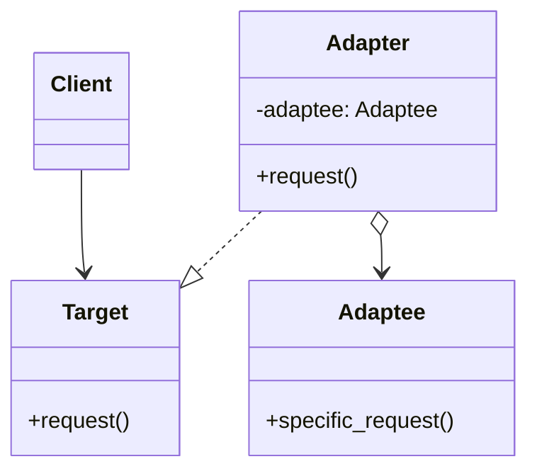

# 🔌 Patron adaptateur (Adapter)

Le patron Adaptateur fait collaborer des interfaces incompatibles en
**convertissant l'interface d'un composant existant (Adaptee)** vers une
**interface attendue par le client (Target)**. Il permet de réutiliser du code
sans le modifier (souvent du code tiers ou hérité) et limite le couplage.

---

## Quand l’utiliser ?

- Réutiliser une classe existante dont l’interface ne correspond pas au besoin
  du client.
- Intégrer une **librairie tierce** ou **du code existant** difficile à modifier.
- **Isoler** l’usage d’une API externe pour faciliter les tests et éviter sa
  propagation.
- **Remplacer** un composant par un autre sans changer le code client (adapter
  l’un à l’interface de l’autre).

---

## Diagrammes de classes



- Le client dépend de `Target` (contrat attendu).
- `Adapter` implémente `Target` et **délègue** à une instance d’`Adaptee`.
- Découplage fort, remplacement aisé de l’adaptee et testabilité accrue.

## Implémentations en Python

<Tabs>
<TabItem value="logger" label="Logger">

Contexte: le client travaille avec `Logger` (méthode `log(msg)`), alors qu’une
librairie tierce expose `ThirdPartyLog.write(level, message)`.

```python
from abc import ABC, abstractmethod

# Interface cible (Target)
class Logger(ABC):
    @abstractmethod
    def log(self, message: str) -> None: ...

# Adaptee (API tierce/legacy)
class ThirdPartyLog:
    def write(self, level: str, message: str) -> None:
        print(f"[{level.upper()}] {message}")

# Adapter par composition
class ThirdPartyLogAdapter(Logger):
    def __init__(self, adaptee: ThirdPartyLog, default_level: str = "info") -> None:
        self._adaptee = adaptee
        self._level = default_level

    def log(self, message: str) -> None:
        # On adapte l'appel: log(msg) -> write(level, message)
        self._adaptee.write(self._level, message)

# Client
def client_code(logger: Logger) -> None:
    logger.log("Démarrage du service…")

# Utilisation
adaptee = ThirdPartyLog()
adapter = ThirdPartyLogAdapter(adaptee, default_level="debug")
client_code(adapter)
```

Points clés:
- Le client ne connaît que `Logger`.
- L’adapteur traduit `log(msg)` en `write(level, message)`.
- Facile à tester (on peut injecter un faux `ThirdPartyLog`).

</TabItem>
<TabItem value="Encodage" label="Encodage">

Adapter une API renvoyant des bytes vers une interface unicode.

```python
from abc import ABC, abstractmethod

class Reader(ABC):  # Target
    @abstractmethod
    def read_text(self) -> str: ...

class ByteSource:  # Adaptee
    def read_bytes(self) -> bytes:
        return b"Bonjour, monde!\n"

class ByteToTextReader(Reader):  # Adapter (composition)
    def __init__(self, source: ByteSource, encoding: str = "utf-8") -> None:
        self._src = source
        self._enc = encoding

    def read_text(self) -> str:
        return self._src.read_bytes().decode(self._enc)

r = ByteToTextReader(ByteSource())
print(r.read_text().strip())  # Bonjour, monde!
```

</TabItem>

<TabItem value="Prises" label="Prises électriques">

Un exemple tirée de la vie courante: un appareil américain (110V) doit être
utilisé avec une prise européenne (220V).

```python
from abc import ABC, abstractmethod

# Interface pour la prise américaine et appareil
# qui utilise l'électricité à 110V

class IPriseAmericaine(ABC):
    @abstractmethod
    def fournir_electricite_110(self) -> float:
        ...

class AppareilAmericain:
    def __init__(self):
        self.voltage = 110

    def utiliser(self, prise: IPriseAmericaine):
        print(f"Utilisation de l'appareil américain avec {prise.fournir_electricite_110()}V")

# Mais seulement une prise européenne est disponible
class PriseEuropeenne:
    def fournir_electricite_220(self):
        return 220

class Adaptateur(IPriseAmericaine):
    def __init__(self, priseEuro: PriseEuropeenne):
        self.priseEuro = priseEuro
    
    def fournir_electricite_110(self):
        return self.priseEuro.fournir_electricite_220() / 2

if __name__ == "__main__":
    priseEuro = PriseEuropeenne()
    adaptateur = Adaptateur(priseEuro)
    appareil = AppareilAmericain()
    appareil.utiliser(adaptateur)
```
</TabItem>
</Tabs>
---

## Avantages et inconvénients

**Avantages**
- Réutilisation de code existant sans le modifier.
- Découplage du client vis‑à‑vis d’API tierces/existantes.
- Simplifie la migration vers une nouvelle implémentation (changer l’adapter).
- Facilite les tests (injection de doublures côté adaptee).

**Inconvénients**
- Multiplie parfois les couches.

### Astuces pratiques

- Documenter clairement la correspondance des méthodes adaptées.
- Pour les formats/protocoles, valider les conversions (encodage, unités, etc.).

---

## Références

- https://refactoring.guru/design-patterns/adapter
- https://en.wikipedia.org/wiki/Adapter_pattern

