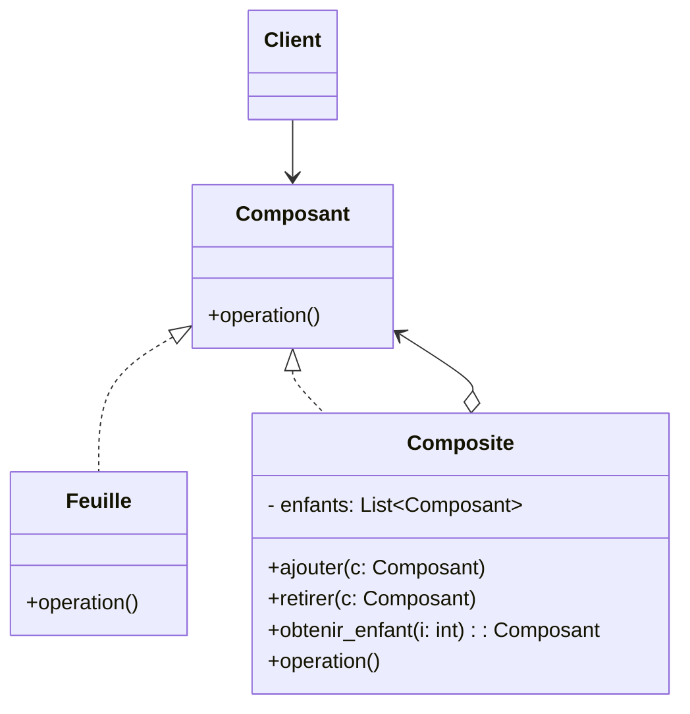

# 🧩 Patron composite

Le patron composite permet de représenter des hiérarchies « partie–tout » et de
traiter de manière uniforme des objets simples (feuilles) et des objets
composés (nœuds composites). Le client utilise la même interface qu’il s’agisse
d’une feuille ou d’un composite, ce qui simplifie le code et favorise le
polymorphisme.

Idée clé : exposer une interface commune et laisser les composites agréger des
composants enfants, tout en se comportant eux‑mêmes comme un composant.

---

## Quand l’utiliser ?

- Pour modéliser des structures arborescentes (système de fichiers, DOM,
  expressions mathématiques, menus).
- Lorsque le client doit pouvoir manipuler indifféremment une feuille et un
  conteneur via la même interface.
- Quand on veut appliquer des opérations récursives sur une hiérarchie
  (afficher, calculer, propager une commande, etc.).
- Pour réduire les if/elif « si feuille alors… sinon composite… » dans le client.

---

## Diagramme de classes



### Explication du diagramme

- `Composant` : interface (ou classe abstraite) commune exposant `operation()`.
- `Feuille` : implémentation terminale sans enfants.
- `Composite` : contient des `Composant` enfants et implémente `operation()` en
  déléguant/agrégeant les résultats de ses enfants.
- `Client` : ne connaît que `Composant`; il peut traiter une feuille et un
  composite de façon identique.

---

## Implémentations en Python

### Arbre de dossiers/fichiers (affichage récursif)

```python
from abc import ABC, abstractmethod
from typing import List

class Noeud(ABC):
	@abstractmethod
	def operation(self, indent: int = 0) -> None: ...

class Fichier(Noeud):
	def __init__(self, nom: str):
		self.nom = nom
	def operation(self, indent: int = 0) -> None:
		print("\t" * indent + f"📄 {self.nom}")

class Dossier(Noeud):
	def __init__(self, nom: str):
		self.nom = nom
		self._enfants: List[Noeud] = []
	def ajouter(self, n: Noeud) -> None:
		self._enfants.append(n)
	def retirer(self, n: Noeud) -> None:
		self._enfants.remove(n)
	def operation(self, indent: int = 0) -> None:
		print("\t" * indent + f"📁 {self.nom}")
		for enfant in self._enfants:
			enfant.operation(indent + 1)

# Client
racine = Dossier("/")
usr = Dossier("usr")
bin = Dossier("bin")
racine.ajouter(usr)
racine.ajouter(bin)
usr.ajouter(Fichier("notes.txt"))
bin.ajouter(Fichier("python.exe"))

racine.operation()
# 📁 /
# 	📁 usr
# 		📄 notes.txt
# 	📁 bin
# 		📄 python.exe
```

Points clés
- Le client appelle `operation()` sur `Noeud` sans savoir s’il s’agit d’un
  `Fichier` ou d’un `Dossier`.
- `Dossier.operation` propage l’appel récursivement.

### Expressions arithmétiques (évaluation)

```python
from __future__ import annotations
from abc import ABC, abstractmethod

class Expression(ABC):
	@abstractmethod
	def eval(self) -> float: ...

class Nombre(Expression):
	def __init__(self, val: float):
		self.val = val
	def eval(self) -> float:
		return self.val

class Addition(Expression):
	def __init__(self, *enfants: Expression):
		self.enfants = list(enfants)
	def eval(self) -> float:
		return sum(e.eval() for e in self.enfants)

class Multiplication(Expression):
	def __init__(self, *enfants: Expression):
		self.enfants = list(enfants)
	def eval(self) -> float:
		res = 1.0
		for e in self.enfants:
			res *= e.eval()
		return res

# (2 + 3) * (4 + 1) = 25
expr = Multiplication(Addition(Nombre(2), Nombre(3)), Addition(Nombre(4), Nombre(1)))
print(expr.eval())  # 25.0
```

Avantage : l’ajout d’un nouvel opérateur (ex. `Soustraction`) n’implique pas de
modifier le code client — on reste sur `Expression`.

---

## Comparaison rapide avec décorateur

Tous deux reposent sur une interface commune; le décorateur enveloppe un
composant pour enrichir son comportement, tandis que le composite agrège des
composants enfants et combine leurs résultats.

---

## Avantages et inconvénients

**Avantages**
- Interface uniforme feuille/composite; simplifie le client.
- Favorise la récursivité et l’extension (ajout de nouveaux types de nœuds).
- Réduction des conditions spécifiques « si feuille… sinon composite… ».


**Inconvénients**
- Parcours et agrégations potentiellement coûteux sur de grands arbres.
- Débogage plus complexe à cause de la récursivité et du polymorphisme (traces
  longues, cycles à éviter).
- Risque d’introduire des cycles si aucune contrainte ne l’empêche.

