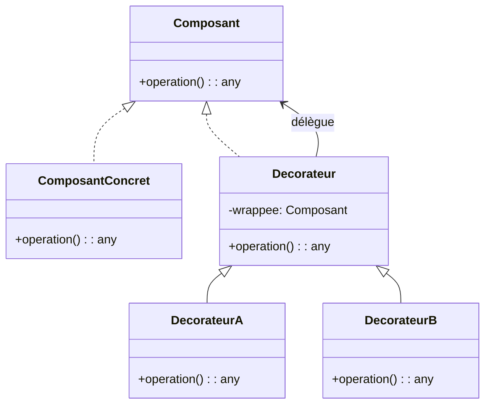

# 🎁 Patron décorateur (Decorator)

Le patron Décorateur permet d’**ajouter dynamiquement des responsabilités**
(comportements) à un objet sans changer son interface ni modifier sa classe. Il
s’agit d’une alternative souple à l’héritage pour l’extension.

Idée clé : on encapsule l’objet cible dans un ou plusieurs « décorateurs » qui
implémentent la même interface et délèguent tout ou partie des appels à l’objet
encapsulé, en ajoutant du traitement avant ou après la délégation.

---

## Quand l’utiliser ?

- Pour ajouter des fonctionnalités de façon **optionnelle et combinable** (ex.
  journalisation, cache, validation, chiffrement, compression).
- Quand l’**héritage** produit une explosion de sous-classes (combinaisons de
  comportements).
- Pour **ouvrir** un objet à des extensions sans modifier son code (OCP).
- Pour **varier l’ordre** d’application des responsabilités à l’exécution.

---

## Diagramme de classes



Le client dépend uniquement de `Composant`. Les décorateurs ajoutent des
responsabilités sans changer l’interface.

### Explication du diagramme

- `Composant` : interface (ou classe abstraite) utilisée par le client.
- `ComposantConcret` : implémentation de base.
- `Decorateur` : classe de base des décorateurs, contient une référence vers un
  `Composant` (la « wrappee ») et délègue par défaut.
- `DecorateurA` / `DecorateurB` : décorateurs concrets ajoutant des comportements avant/après la délégation.
- Les décorateurs peuvent être empilés (chaînés) pour composer des
  responsabilités.

---

## Exemple d'implémentations en Python

### Décorateurs d’envoi de notifications (journalisation et antispam)

Un exemple montrant l’ajout de responsabilités.

```python
from abc import ABC, abstractmethod
import time

class Notificateur(ABC):
    @abstractmethod
    def envoyer(self, message: str) -> None: ...

class EmailNotificateur(Notificateur):
    def envoyer(self, message: str) -> None:
        print(f"[EMAIL] {message}")

class NotificateurDecorateur(Notificateur):
    def __init__(self, wrappee: Notificateur):
        self._wrappee = wrappee

    def envoyer(self, message: str) -> None:
        self._wrappee.envoyer(message)

class JournalisationDecorateur(NotificateurDecorateur):
    def envoyer(self, message: str) -> None:
        print(f"[LOG {time.strftime('%H:%M:%S')}] avant envoi")
        super().envoyer(message)
        print("[LOG] après envoi")

class AntiSpamDecorateur(NotificateurDecorateur):
    def __init__(self, wrappee: Notificateur, intervalle_s: float = 1.0):
        super().__init__(wrappee)
        self._intervalle = intervalle_s
        self._dernier = 0.0

    def envoyer(self, message: str) -> None:
        maintenant = time.time()
        if maintenant - self._dernier < self._intervalle:
            print("[SPAM BLOQUÉ]")
            return
        self._dernier = maintenant
        super().envoyer(message)

# Composition à la volée
notif: Notificateur = EmailNotificateur()
notif = JournalisationDecorateur(AntiSpamDecorateur(notif, intervalle_s=0.5))
notif.envoyer("Bonjour")
notif.envoyer("Bonjour")  # probablement bloqué selon le timing
```

---

## Avantages et inconvénients

**Avantages**
- Ajout de fonctionnalités sans modifier les classes existantes (OCP).
- Combinaison flexible de responsabilités à l’exécution.
- Favorise la composition plutôt que l’héritage.

**Inconvénients**
- Multiplication de petits objets chaînés, **plus difficile à déboguer**.
- L’ordre d’empilage peut être source de bugs subtils.
- Peut compliquer la configuration et la lisibilité si sur‑utilisé.

---

## Astuces pratiques

- Garder l’interface du décorateur strictement **transparente** (même contrat que le composant).
- Préférer un **décorateur de base** qui délègue par défaut, pour éviter de répéter du code.
- Documenter l’**ordre recommandé** d’empilage et, si possible, fournir des constructeurs utilitaires.
- Éviter d’exposer la « wrappee » au client pour ne pas recoupler inutilement.


---

## Références

- https://refactoring.guru/design-patterns/decorator
- https://en.wikipedia.org/wiki/Decorator_pattern

