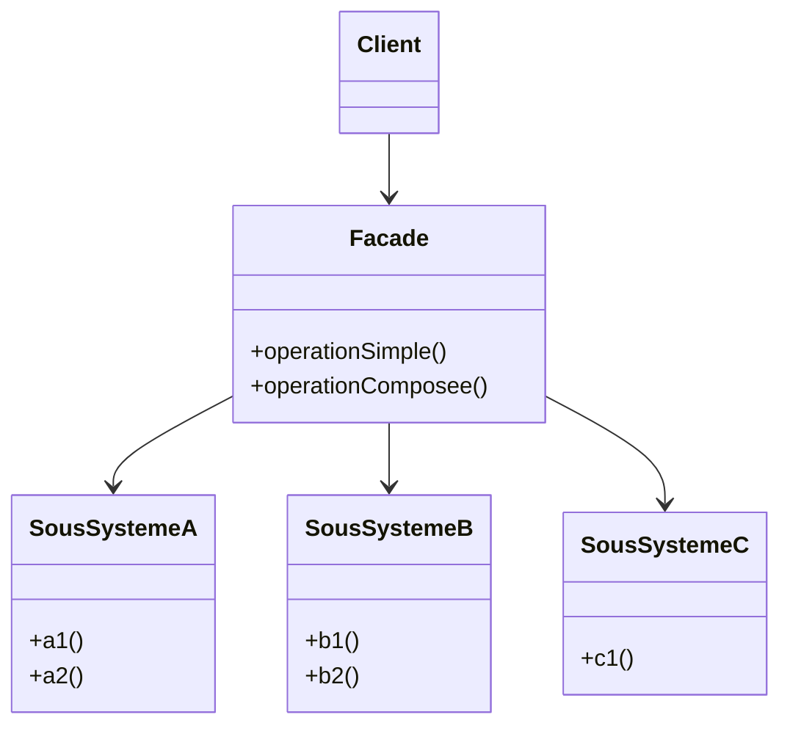

# 🏠 Patron façade

Le patron façade fournit une **interface unifiée et simplifiée** vers un
ensemble d’interfaces appartenant à un sous‑système. Il masque la complexité interne et
réduit le couplage entre le client et les composants internes. Le client
utilise la façade pour réaliser des tâches courantes sans connaître les détails
du fonctionnement des sous‑systèmes.

Idée clé : la façade n’interdit pas l’accès direct aux sous‑systèmes — elle
propose un raccourci « prêt à l’emploi » pour les scénarios fréquents.

---

## Quand l’utiliser ?

- Lorsque l’API d’un sous‑système est complexe ou verbeuse et qu’on veut
  exposer une **API simple et cohérente** aux clients.
- Pour **réduire le couplage** entre le code client et de multiples classes
  internes (isoler l’impact des changements).
- Pour **guider l’usage**: offrir des parcours « happy path » sûrs et testés.
- Comme **point d’entrée unique** tout en conservant la flexibilité
  d’utiliser les composants bas niveau au besoin.
- En complément d’un système hérité (legacy) pour **moderniser l’interface**
  sans refactoriser tout le code interne.

---

## Diagramme de classes



### Explication du diagramme

- `SousSystemeA/B/C` : classes internes réalisant le vrai travail, avec leurs
  propres API.
- `Facade` : regroupe des opérations de plus haut niveau (`operationSimple`,
  `operationComposee`) en orchestrant plusieurs appels aux sous‑systèmes.
- `Client` : dépend uniquement de la façade pour les cas d’usage communs,
  diminuant ainsi sa dépendance envers les détails internes.

---

## Exemple en Python

### Façade « home cinéma » (orchestration de sous‑systèmes)

```python
class Amplificateur:
	def allumer(self):
		print("Amplificateur ON")
	def regler_volume(self, niveau: int):
		print(f"Volume -> {niveau}")
	def eteindre(self):
		print("Amplificateur OFF")

class LecteurVideo:
	def allumer(self):
		print("Lecteur vidéo ON")
	def lire(self, titre: str):
		print(f"Lecture du film: {titre}")
	def arreter(self):
		print("Arrêt lecture")
	def eteindre(self):
		print("Lecteur vidéo OFF")

class Eclairage:
	def tamiser(self, niveau: int):
		print(f"Éclairage -> {niveau}%")
	def allumer(self):
		print("Éclairage ON")

class HomeCinemaFacade:
	def __init__(self, amp: Amplificateur, video: LecteurVideo, light: Eclairage):
		self.amp = amp
		self.video = video
		self.light = light

	def lancer_film(self, titre: str):
		print("[Façade] Préparer la séance")
		self.light.tamiser(30)
		self.amp.allumer()
		self.amp.regler_volume(20)
		self.video.allumer()
		self.video.lire(titre)

	def arreter_film(self):
		print("[Façade] Terminer la séance")
		self.video.arreter()
		self.video.eteindre()
		self.amp.eteindre()
		self.light.allumer()

# Client
amp = Amplificateur()
video = LecteurVideo()
light = Eclairage()
cinema = HomeCinemaFacade(amp, video, light)

cinema.lancer_film("Inception")
cinema.arreter_film()
```

Le client n’a pas besoin de connaître la séquence exacte d’appels ni l’ordre.
La façade orchestre les sous‑systèmes.

### Façade « commande en ligne » (processus métier)

```python
class AuthService:
	def verifier(self, user_id: str) -> bool:
		print(f"Auth: vérifier {user_id}")
		return True

class StockService:
	def reserver(self, items: list[tuple[str, int]]) -> bool:
		print(f"Stock: réserver {items}")
		return True

class PaiementService:
	def payer(self, user_id: str, montant: float) -> bool:
		print(f"Paiement: {user_id} -> {montant:.2f} $")
		return True

class EmailService:
	def envoyer_confirmation(self, user_id: str, commande_id: str):
		print(f"Email: confirmation envoyée à {user_id} pour {commande_id}")

class BoutiqueFacade:
	def __init__(self, auth: AuthService, stock: StockService, pay: PaiementService, mail: EmailService):
		self.auth = auth
		self.stock = stock
		self.pay = pay
		self.mail = mail

	def passer_commande(self, user_id: str, panier: list[tuple[str, int]]) -> str:
		if not self.auth.verifier(user_id):
			raise PermissionError("Utilisateur non authentifié")
		if not self.stock.reserver(panier):
			raise RuntimeError("Rupture de stock")
		montant = sum(qte * 10.0 for _, qte in panier)  # exemple
		if not self.pay.payer(user_id, montant):
			raise RuntimeError("Échec du paiement")
		commande_id = "CMD-12345"
		self.mail.envoyer_confirmation(user_id, commande_id)
		return commande_id

# Client
facade = BoutiqueFacade(AuthService(), StockService(), PaiementService(), EmailService())
commande = facade.passer_commande("u42", [("sku-1", 2), ("sku-2", 1)])
print("Commande créée:", commande)
```

La façade expose une méthode commande sans exposer chaque service au client.

---

## Comparaison rapide avec Adaptateur

Façade simplifie/agrège une API existante. Adaptateur convertit une **interface incompatible** vers une autre attendue par le client.

---

## Avantages et inconvénients

**Avantages**
- Réduit la complexité perçue et le couplage du client.
- Point d’entrée unique facilitant l’**évolution** et la **stabilisation de l’API**.
- Favorise la **lisibilité** des cas d’usage et l’**isolation** des dépendances.

**Inconvénients**
- Risque de devenir un **dieu‑objet** si la façade grossit trop.
- Peut masquer des erreurs de design sous‑jacentes.
- Ajoute une couche supplémentaire.

---

## Références

- https://refactoring.guru/design-patterns/facade
- https://en.wikipedia.org/wiki/Facade_pattern
- https://www.geeksforgeeks.org/system-design/facade-design-pattern-introduction/

