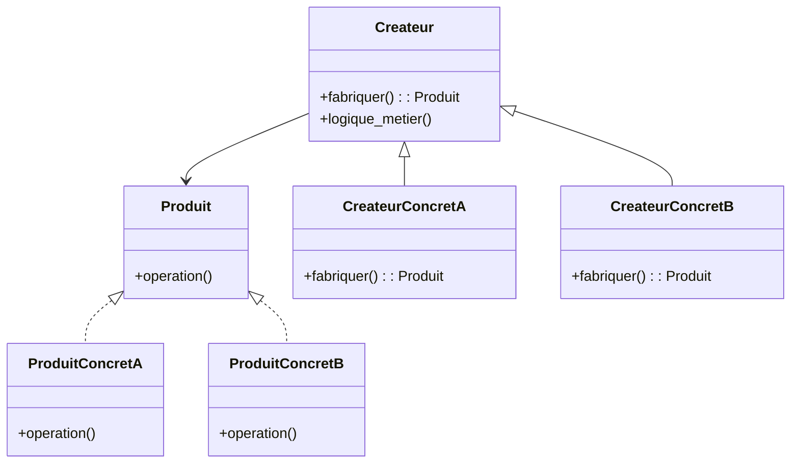
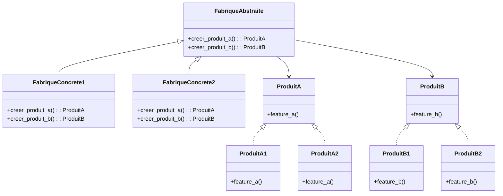

# 🏭 Patrons factory et abstract factory

Le terme « factory » regroupe plusieurs variantes ayant pour objectif principal
de **déléguer la création d'objets** à un composant spécialisé plutôt que
d'instancier directement des classes concrètes dans le code client. Cela réduit
le couplage, centralise la logique d'instanciation et facilite l'extension.

Dans la littérature des patrons GoF, on distingue principalement :

- Simple Factory (souvent utilisée mais pas un patron « officiel » GoF) – centralise la création.
- Factory Method – laisse les sous-classes décider des classes concrètes à instancier.
- Abstract Factory – crée des familles d’objets cohérentes sans préciser leurs classes concrètes.

---

## Quand l’utiliser ?

- Lorsque le code client **ne doit pas connaître** les classes concrètes instanciées.
- Quand la logique de création est **complexe**, conditionnelle ou dépend d'entrées externes (config, données, contexte).
- Pour **remplacer des constructions `if/elif` / `match` répétitives** dispersées dans le projet.
- Pour **regrouper la création de familles d’objets compatibles** (Abstract Factory).
- Pour **faciliter les tests** (injection de factories simulées / mocks).
- Pour **appliquer le principe Ouvert/Fermé (OCP)** : ajouter un nouveau produit sans modifier le client existant.

---

## Diagrammes de classes

### Factory Method



Le client manipule `Createur` et reste découplé des produits concrets.

#### Explication du diagramme (Factory Method)

- `Produit` : interface (ou classe abstraite) commune que le client utilisera.
- `ProduitConcretA` / `ProduitConcretB` : implémentations spécifiques de `Produit`.
- `Createur` : définit la méthode **factory** abstraite `fabriquer()` et peut contenir de la logique métier (`logique_metier`) qui s'appuie sur l'objet retourné sans connaître sa classe concrète.
- `CreateurConcretA` / `CreateurConcretB` : spécialisent la création en retournant respectivement `ProduitConcretA` ou `ProduitConcretB`.


Idée clé : pour introduire un nouveau produit, on ajoute une sous-classe de `Createur` et une classe de produit — le code client qui consomme `Createur` n'est pas modifié.

### Abstract Factory (famille de produits)



Chaque fabrique concrète produit une **famille cohérente** (`ProduitA1` avec `ProduitB1`, etc.).

#### Explication du diagramme (Abstract Factory)

- `FabriqueAbstraite` : contrat regroupant les méthodes de création pour chaque type de produit de la famille (`creer_produit_a`, `creer_produit_b`).
- `FabriqueConcrete1` / `FabriqueConcrete2` : fournissent des combinaisons cohérentes d'implémentations concrètes (ex. thème clair vs sombre, SGBD MySQL vs PostgreSQL, etc.).
- `ProduitA` / `ProduitB` : interfaces (ou classes abstraites) des différentes catégories de produits.
- `ProduitA1` / `ProduitA2` et `ProduitB1` / `ProduitB2` : variantes concrètes appartenant à des familles correspondantes (1 ou 2).
- Les fabriques concrètes garantissent la cohérence interne : en choisissant une fabrique, on obtient automatiquement une famille de composants compatibles entre eux.
- Le client dépend uniquement de `FabriqueAbstraite` et des interfaces `ProduitA` / `ProduitB`, ce qui permet de changer toute la famille d'objets en injectant une autre fabrique.

Idée clé : changer d’environnement / thème / fournisseur = remplacer la fabrique injectée, sans toucher au reste du code.

---

## Implémentations en Python

### 1. Simple Factory (centralisation basique)

> Pas un patron GoF formel, mais très courant. Utile pour remplacer des blocs conditionnels dispersés.

```python
from abc import ABC, abstractmethod

class Forme(ABC):
	@abstractmethod
	def aire(self): ...

class Cercle(Forme):
	def __init__(self, r: float):
		self.r = r
	def aire(self):
		return 3.1416 * self.r ** 2

class Carre(Forme):
	def __init__(self, cote: float):
		self.cote = cote
	def aire(self):
		return self.cote ** 2

class FormeFactory:
	@staticmethod
	def creer(type_forme: str, *args) -> Forme:
		match type_forme.lower():
			case 'cercle':
				return Cercle(*args)
			case 'carre':
				return Carre(*args)
			case _:
				raise ValueError(f"Type de forme inconnu: {type_forme}")

f1 = FormeFactory.creer('cercle', 2)
f2 = FormeFactory.creer('carre', 3)
print(f1.aire(), f2.aire())  # 12.5664 9
```

Limite : ajouter un type implique de modifier la factory (pas totalement conforme au principe Ouvert/Fermé – OCP).

### 2. Factory Method (GoF)

Ici, la méthode de création (`fabriquer`) est **déportée dans les sous-classes**. Le code métier dans la classe de base peut utiliser le produit abstrait sans connaître sa classe concrète.

```python
from abc import ABC, abstractmethod

class Document(ABC):
	@abstractmethod
	def exporter(self) -> str: ...

class PDF(Document):
	def exporter(self) -> str:
		return "Export PDF"

class CSV(Document):
	def exporter(self) -> str:
		return "Export CSV"

class Createur(ABC):
	def logique_metier(self) -> str:
		doc = self.fabriquer()
		return f"[LOG] {doc.exporter()}"

	@abstractmethod
	def fabriquer(self) -> Document: ...

class CreateurPDF(Createur):
	def fabriquer(self) -> Document:
		return PDF()

class CreateurCSV(Createur):
	def fabriquer(self) -> Document:
		return CSV()

def client(createur: Createur):
	print(createur.logique_metier())

client(CreateurPDF())  # [LOG] Export PDF
client(CreateurCSV())  # [LOG] Export CSV
```

Avantage : pour un nouveau format, on crée une nouvelle sous-classe sans modifier le client.

### 3. Abstract Factory (familles de produits)

On encapsule la création d’objets qui doivent fonctionner ensemble (ex. UI sombre vs claire, drivers de base de données, widgets multi-plateforme).

```python
from abc import ABC, abstractmethod

# Produits abstraits
class Bouton(ABC):
	@abstractmethod
	def dessiner(self) -> str: ...

class Fenetre(ABC):
	@abstractmethod
	def ouvrir(self) -> str: ...

# Implémentations concrètes (Thème Clair)
class BoutonClair(Bouton):
	def dessiner(self) -> str:
		return "Bouton clair"

class FenetreClair(Fenetre):
	def ouvrir(self) -> str:
		return "Fenêtre claire"

# Implémentations concrètes (Thème Sombre)
class BoutonSombre(Bouton):
	def dessiner(self) -> str:
		return "Bouton sombre"

class FenetreSombre(Fenetre):
	def ouvrir(self) -> str:
		return "Fenêtre sombre"

# Fabrique abstraite
class UIFactory(ABC):
	@abstractmethod
	def creer_bouton(self) -> Bouton: ...
	@abstractmethod
	def creer_fenetre(self) -> Fenetre: ...

class UIFactoryClair(UIFactory):
	def creer_bouton(self) -> Bouton:
		return BoutonClair()
	def creer_fenetre(self) -> Fenetre:
		return FenetreClair()

class UIFactorySombre(UIFactory):
	def creer_bouton(self) -> Bouton:
		return BoutonSombre()
	def creer_fenetre(self) -> Fenetre:
		return FenetreSombre()

def rendre_ui(factory: UIFactory):
	b = factory.creer_bouton()
	f = factory.creer_fenetre()
	print(b.dessiner())
	print(f.ouvrir())

rendre_ui(UIFactoryClair())
rendre_ui(UIFactorySombre())
```

Changer de thème = injecter une autre fabrique sans toucher au code métier.

---

## Comparaison rapide

| Variante | Intention | Extension |
|----------|-----------|-----------|
| Simple Factory | Centraliser des constructions | Modifier la factory |
| Factory Method | Laisser les sous-classes décider | Ajouter une sous-classe |
| Abstract Factory | Produire des familles cohérentes | Ajouter une fabrique |

---

## Avantages et inconvénients

**Avantages**
- Réduction du couplage aux classes concrètes (dépendance envers des abstractions).
- Centralisation / encapsulation de la logique d’instanciation.
- Facilite les tests (injection de factory mock / stub).
- Ouvre la porte au polymorphisme et au remplacement dynamique.

**Inconvénients**
- Multiplication des classes (surtout avec Abstract Factory).
- Peut paraître sur‑ingénieré pour des cas simples.
- Chaînage de niveaux d’abstraction pouvant complexifier le débogage.
- Simple Factory casse OCP (modification pour chaque nouveau type) si non combinée avec enregistrement dynamique.

### Astuces pratiques

- Utiliser un **registre dynamique** (ex. : dict type -> classe) pour éviter d’éditer la factory.
- Combiner avec **Singleton** si la factory elle-même doit être unique.
- Pour la config / l’injection : passer la factory en paramètre plutôt que d’appeler une variable globale.

---

## Références

- https://refactoring.guru/design-patterns/factory-method
- https://refactoring.guru/design-patterns/abstract-factory
- https://en.wikipedia.org/wiki/Factory_method_pattern
- https://en.wikipedia.org/wiki/Abstract_factory_pattern
