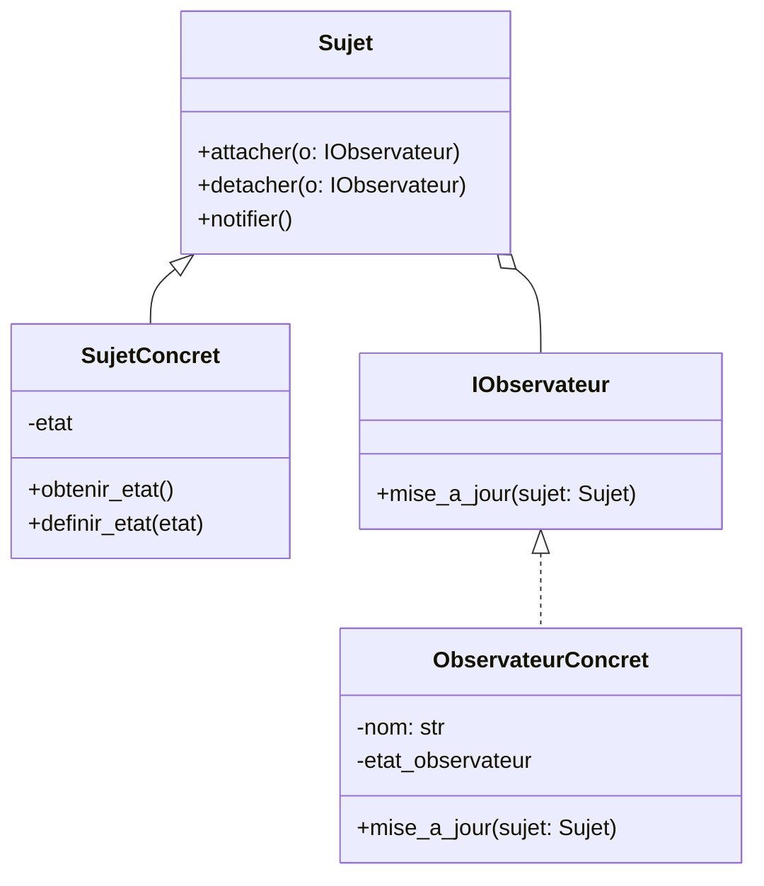

# 👓 Patron observateur


Lorsqu'un événement survient dans un programme, il est souvent nécessaire de
notifier plusieurs parties de l'application. Le patron observateur permet de
gérer cette relation de manière efficace et flexible. Il est particulièrement
utile dans les applications où plusieurs composants doivent réagir à des
changements d'état d'un objet central.


Le patron observateur (Observer) permet de définir une relation un-à-plusieurs
entre objets, de sorte que lorsque l'état d'un objet (le *sujet*) change, tous
ses *observateurs* sont automatiquement notifiés et mis à jour.

## Quand l’utiliser ?

- Pour **découpler** des objets producteurs d’événements et consommateurs.
- Mise en œuvre d’un **système d’événements** ou de **callbacks**.
- **Interfaces graphiques** : notifier plusieurs composants à chaque modification de données.
- **Gestion de notifications** : envoi d’alertes, log, UI, etc.

## Diagramme de classes

Le diagramme de classes ci-dessous illustre la structure du patron observateur :




La classe qui émet les notifications est appelée `Sujet`. Elle maintient une
liste d'observateurs et notifie chacun d'eux lorsqu'un changement d'état se
produit. Si l'on veut respecter les principes SOLID, cette classe ne gère que
les notifications et ne contient pas de logique métier. Ce sont les sous-classes (`SujetConcret`)
qui implémentent la logique métier.


Les classes `IObservateur` et `ObservateurConcret` définissent le contrat
pour les observateurs. Chaque observateur doit implémenter la méthode `mise_a_jour`
qui sera appelée par le sujet lorsqu'un changement d'état se produit.

## Implémentation en Python


Dans cet exemple, le sujet et le sujet concret sont fusionnés pour simplifier
la démonstration.

```python
from abc import ABC, abstractmethod

class Observateur(ABC):
    @abstractmethod
    def mise_a_jour(self, sujet):
        pass

class Sujet:
    def __init__(self):
        self._observateurs = []
        self._etat = None


    def attacher(self, observateur: Observateur):
        self._observateurs.append(observateur)


    def detacher(self, observateur: Observateur):
        self._observateurs.remove(observateur)


    def notifier(self):
        for obs in self._observateurs:
            obs.mise_a_jour(self)


    def obtenir_etat(self):
        return self._etat


    def definir_etat(self, etat):
        self._etat = etat
        self.notifier()

class ObservateurConcret(Observateur):

    def __init__(self, nom: str):
        self._nom = nom
        self._etat_observateur = None


    def mise_a_jour(self, sujet: Sujet):
        self._etat_observateur = sujet.obtenir_etat()
        print(f"{self._nom} a reçu une mise à jour : {self._etat_observateur}")
``` 


### Exemple d'utilisation

```python
if __name__ == '__main__':

    sujet = Sujet()

    obs1 = ObservateurConcret('Observateur A')
    obs2 = ObservateurConcret('Observateur B')

    sujet.attacher(obs1)
    sujet.attacher(obs2)

    sujet.definir_etat('État initial')
    # Observateur A a reçu une mise à jour : État initial
    # Observateur B a reçu une mise à jour : État initial

    sujet.definir_etat('Nouvelle valeur')
    # Observateur A a reçu une mise à jour : Nouvelle valeur
    # Observateur B a reçu une mise à jour : Nouvelle valeur
``` 

## Exemple fait en classe

Ceci est le code que nous avons fait en classe pour illustrer le patron observateur.

```python
from abc import ABC, abstractmethod


class IObservateur(ABC):
    @abstractmethod
    def mettre_a_jour(self, nb_participants):
        pass

class Admin(IObservateur):
    def mettre_a_jour(self, nb_participants):
        print(f"[Admin] : Le cours aura bien lieu avec {nb_participants} participants.")

class Participants(IObservateur):
    def mettre_a_jour(self, nb_participants):
        for i in range(nb_participants):
            print(f"[Participant {i + 1}] : Le cours aura bien lieu.")

class ServiceInformatique(IObservateur):
    def mettre_a_jour(self, nb_participants):
        print(f"[Service informatique] : Le cours aura bien lieu avec {nb_participants} participants.")

class Professeur(IObservateur):
    def __init__(self, notification=True):
        self.notification = notification

    def mettre_a_jour(self, nb_participants):
        if self.notification:
            print(f"[Professeur] : Le cours aura bien lieu avec {nb_participants} participants.")

class Emetteur:
    def __init__(self):
        self.observateurs: list[IObservateur] = []

    def ajouter_observateur(self, observateur: IObservateur):
        self.observateurs.append(observateur)

    def retirer_observateur(self, observateur: IObservateur):
        if observateur in self.observateurs:
            self.observateurs.remove(observateur)

    def notifier_observateurs(self, nb_participants):
        for observateur in self.observateurs:
            observateur.mettre_a_jour(nb_participants)

class Cours(Emetteur):
    def __init__(self, nom):
        super().__init__()
        self.nom = nom
        self.participants = 0

    def ajouter_participant(self):
        self.participants += 1
        if self.participants == 5:
            self.notifier_observateurs(self.participants)


class Tutorat(Emetteur):
    def __init__(self, nom):
        super().__init__()
        self.nom = nom
        self.participants = 0

    def ajouter_participant(self):
        self.participants += 1
        if self.participants == 3:
            self.notifier_observateurs(self.participants)

a = Cours("Yoga")
a.ajouter_observateur(Admin())
a.ajouter_observateur(Participants())
a.ajouter_observateur(ServiceInformatique())
a.ajouter_observateur(Professeur(False))
for i in range(10):
    a.ajouter_participant()
```

## Avantages et inconvénients


**Avantages**
- Faible couplage entre émetteur et récepteurs.
- Extensible : on peut ajouter de nouveaux observateurs sans modifier le sujet.


**Inconvénients**
- Risque de **fuites de mémoire** si l'on oublie de détacher.
- Ordre de notification **non garanti**.
- Difficile à déboguer s'il y a de nombreux observateurs.


## Références

- https://refactoring.guru/design-patterns/observer
- https://en.wikipedia.org/wiki/Observer_pattern
