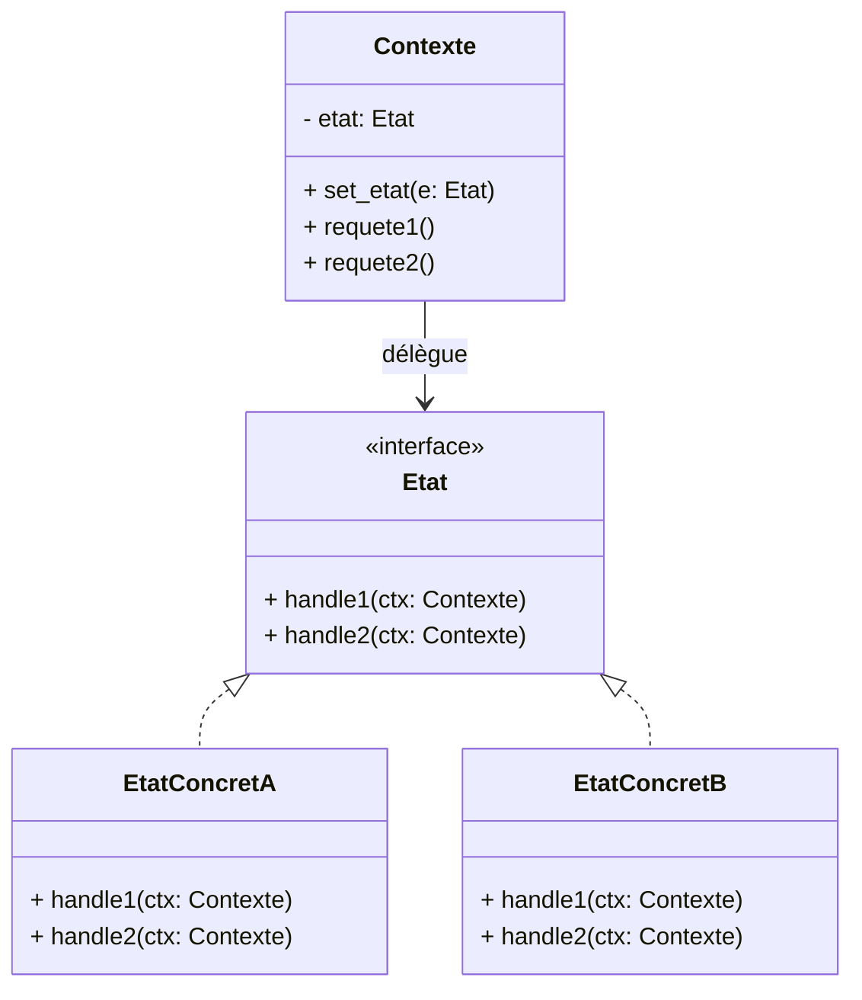

# 🔄 Patron State

Le patron State permet à un objet de changer son comportement lorsque son
**état interne** change. Plutôt que d’avoir des blocs conditionnels partout, le
Contexte délègue à un objet État qui encapsule la logique liée à cet état et
peut décider des transitions.

Idée clé: remplacer les `if/elif` sur une variable `etat` par des classes État spécialisées.

---

## Quand l’utiliser ?

- Quand le comportement dépend fortement de l’état courant (machine à états
  finis).
- Quand on voit des conditions répétées qui testent `etat` pour décider quoi
  faire.
- Pour ajouter facilement de nouveaux états/comportements sans toucher au code
  client (OCP).
- Pour rendre explicites les transitions et faciliter les tests.

---

## Diagramme de classes



- `Etat` : interface (ou classe abstraite) pour le comportement dépendant de l’état.
- `EtatConcretA/B` : implémentent la logique propre à chaque état et les transitions.
- `Contexte` : pointe sur l’état courant et délègue l’API publique.

---

## Implémentations en Python

### Lecteur audio (arrêt/lecture/pause)

```python
from abc import ABC, abstractmethod

class Lecteur:
    def __init__(self):
        self._etat: EtatLecteur = Arret()
    def set_etat(self, e: EtatLecteur) -> None:
        self._etat = e
    def play(self): self._etat.play(self)
    def pause(self): self._etat.pause(self)
    def stop(self): self._etat.stop(self)

class EtatLecteur(ABC):
    @abstractmethod
    def play(self, ctx: Lecteur) -> None: ...
    @abstractmethod
    def pause(self, ctx: Lecteur) -> None: ...
    @abstractmethod
    def stop(self, ctx: Lecteur) -> None: ...

class Arret(EtatLecteur):
    def play(self, ctx: Lecteur) -> None:
        print("Arret → Lecture")
        ctx.set_etat(Lecture())
    def pause(self, ctx: Lecteur) -> None:
        print("Arret: pause sans effet")
    def stop(self, ctx: Lecteur) -> None:
        print("Arret: déjà stoppé")

class Lecture(EtatLecteur):
    def play(self, ctx: Lecteur) -> None:
        print("Lecture: déjà en lecture")
    def pause(self, ctx: Lecteur) -> None:
        print("Lecture → Pause")
        ctx.set_etat(Pause())
    def stop(self, ctx: Lecteur) -> None:
        print("Lecture → Arret")
        ctx.set_etat(Arret())

class Pause(EtatLecteur):
    def play(self, ctx: Lecteur) -> None:
        print("Pause → Lecture")
        ctx.set_etat(Lecture())
    def pause(self, ctx: Lecteur) -> None:
        print("Pause: déjà en pause")
    def stop(self, ctx: Lecteur) -> None:
        print("Pause → Arret")
        ctx.set_etat(Arret())

mp = Lecteur()
mp.play()
mp.pause()
mp.play()
mp.stop()
```

---

## State vs Strategy

- Strategy: on choisit l’algorithme de l’extérieur; pas de transitions internes.
- State: transitions internes gouvernent le changement de comportement.

---

## Avantages et inconvénients

**Avantages**
- Supprime les conditions massives sur l’état.
- Ajout d’états/transitions sans casser l’API client (OCP).
- Code plus modulaire et testable.

**Inconvénients**
- Plus de classes/fichiers.
- Modélisation des transitions requise pour éviter la complexité.

---

## Références

- https://refactoring.guru/design-patterns/state
- https://en.wikipedia.org/wiki/State_pattern
- https://www.geeksforgeeks.org/system-design/state-design-pattern/

