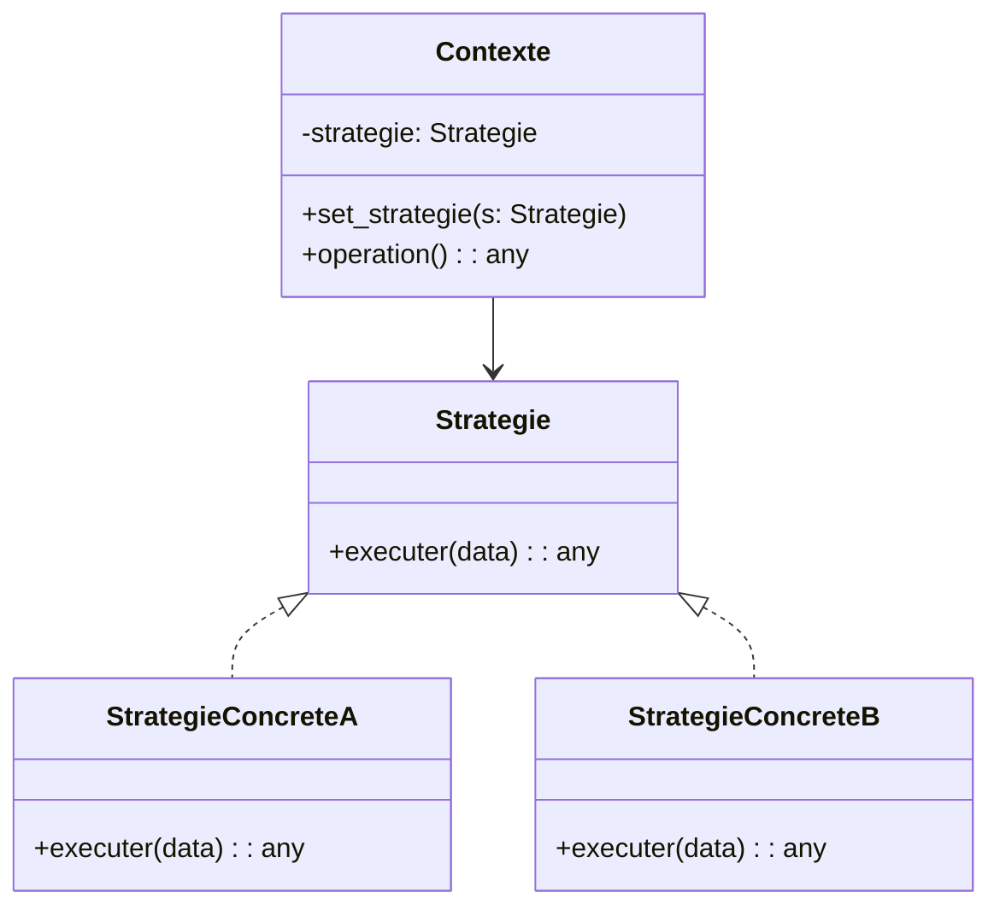

# 🎯 Patron Strategy

Le patron Strategy permet de définir plusieurs façons d’exécuter un même
comportement et de choisir laquelle utiliser pendant l’exécution sans avoir à
écrire plein de if/elif.

Idée clé : définir un contrat commun (interface/ABC) pour les algorithmes obtenir 
l'algorithme précis via un paramètre ou l'injection des dépendances.

---

## Quand l’utiliser ?

- Plusieurs variantes d’un même comportement.
- Changer l’algorithme à l’exécution sans modifier le client.
- Supprimer des conditionnels répétitifs de sélection de comportement.
- Ouvrir la porte à de nouvelles variantes sans toucher au contexte (OCP).
- Tester les algorithmes isolément (injection d’une stratégie simulée).

---

## Diagramme de classes



- Contexte : contient une référence à une `Strategie` et lui délègue la partie
  variable de l’algorithme.
- Strategie : contrat commun que toutes les stratégies concrètes implémentent.
- StrategieConcreteA/B : variantes d’implémentation interchangeables.

---

## Implémentations en Python

### Stratégie métier : politique de taxes

```python
from abc import ABC, abstractmethod
from dataclasses import dataclass

class StrategieTaxe(ABC):
	@abstractmethod
	def calculer(self, sous_total: float) -> float: ...

class TaxeQC(StrategieTaxe):
	# Simplifié: TPS 5% + TVQ 9.975%
	def calculer(self, sous_total: float) -> float:
		return sous_total * (0.05 + 0.09975)

class TaxeON(StrategieTaxe):
	# HST 13%
	def calculer(self, sous_total: float) -> float:
		return sous_total * 0.13

class SansTaxe(StrategieTaxe):
	def calculer(self, sous_total: float) -> float:
		return 0.0

@dataclass
class Panier:
	articles: list[float]
	strategie_taxe: StrategieTaxe

	def set_strategie(self, s: StrategieTaxe) -> None:
		self.strategie_taxe = s

	def total(self) -> float:
		sous_total = sum(self.articles)
		return sous_total + self.strategie_taxe.calculer(sous_total)

p = Panier([10.0, 25.0, 5.0], TaxeQC())
print(p.total())  # Stratégie QC

p.set_strategie(TaxeON())
print(p.total())  # Bascule vers ON

p.set_strategie(SansTaxe())
print(p.total())  # Exemptions / tests
```

Points notables :
- Le panier dépend d’une abstraction, pas d’une implémentation concrète.
- Changer de politique de taxes = injection d’une autre stratégie.

### Stratégie algorithmique : tri

```python
from abc import ABC, abstractmethod
from random import randint

class StrategieTri(ABC):
	@abstractmethod
	def trier(self, donnees: list[int]) -> list[int]: ...

class TriPythonSort(StrategieTri):
	def trier(self, donnees: list[int]) -> list[int]:
		return sorted(donnees)

class TriInsertion(StrategieTri):
	def trier(self, donnees: list[int]) -> list[int]:
		arr = donnees[:]
		for i in range(1, len(arr)):
			cle = arr[i]
			j = i - 1
			while j >= 0 and arr[j] > cle:
				arr[j + 1] = arr[j]
				j -= 1
			arr[j + 1] = cle
		return arr

class ContexteTri:
	def __init__(self, strategie: StrategieTri):
		self._strategie = strategie

	def set_strategie(self, strategie: StrategieTri) -> None:
		self._strategie = strategie

	def executer(self, donnees: list[int]) -> list[int]:
		return self._strategie.trier(donnees)

# Démo
arr = [randint(0, 100) for _ in range(10)]
ctx = ContexteTri(TriPythonSort())
print("sort:", ctx.executer(arr))

ctx.set_strategie(TriInsertion())
print("insertion:", ctx.executer(arr))
```

Remarques :
- On compare facilement plusieurs algorithmes sur les mêmes données.
- Ajouter un nouveau tri = implémenter `StrategieTri` sans modifier `ContexteTri`.

### Variante pythonique : fonctions comme stratégies

En Python, les fonctions sont des objets de première classe. On peut utiliser
des `callable` à la place d’une interface formelle.

```python
def taxe_qc(sous_total: float) -> float:
	return sous_total * (0.05 + 0.09975)

def taxe_on(sous_total: float) -> float:
	return sous_total * 0.13

def sans_taxe(sous_total: float) -> float:
	return 0.0

class Panier2:
	def __init__(self, articles: list[float], strategie_taxe):
		self.articles = articles
		self.strategie_taxe = strategie_taxe  # callable

	def set_strategie(self, s):
		self.strategie_taxe = s

	def total(self) -> float:
		sous_total = sum(self.articles)
		return sous_total + self.strategie_taxe(sous_total)

p = Panier2([10, 20], taxe_qc)
print(p.total())
```

---

## Différences avec d’autres patrons

- State : semblable car il change le comportement via un objet; mais State
  modélise des états internes et transitions, alors que Strategy choisit un
  algorithme parmi des alternatives.
- Factory Method / Abstract Factory : s’occupent de créer des objets; Strategy
  s’occupe de la logique de traitement interchangeable.

---

## Avantages et inconvénients

Avantages
- Évite les gros blocs conditionnels en isolant la variation dans des classes
  dédiées.
- Permet de changer/ajouter des algorithmes sans modifier le contexte (OCP).
- Facilite tests et benchmarks (isolation des variantes).

Inconvénients
- Davantage de classes/objets à gérer si le cas est simple.
- Le client doit connaître et injecter une stratégie appropriée.

---

## Références

- https://refactoring.guru/design-patterns/strategy
- https://en.wikipedia.org/wiki/Strategy_pattern
- https://www.geeksforgeeks.org/system-design/strategy-pattern-set-1/

